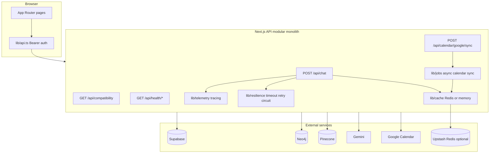

# SkinSafe Architecture

SkinSafe is a **modular monolith**: one Next.js application coordinating **four external data planes** (Supabase, Neo4j, Pinecone, Gemini) with production-oriented patterns for caching, reliability, observability, and async work.

## System context



## Core domains

| Domain | Routes | Data stores |
|--------|--------|-------------|
| Identity / profile | `/api/profile` | Supabase |
| Routines | `/api/routine*` | Supabase |
| Compatibility | `/api/compatibility` | Supabase + Neo4j + Pinecone embed |
| Chat guidance | `POST /api/chat` | Pinecone + Neo4j + Gemini |
| Calendar | `/api/calendar/google/*` | Supabase + Gemini ToT + Google |
| Health | `/api/health`, `/live`, `/ready` | Dependency probes |

## Chat pipeline

1. **Auth** — Bearer JWT required (`getUserFromRequest`).
2. **Rate limit** — Redis/memory token bucket per user (`CHAT_RATE_LIMIT_PER_MIN`, default 30).
3. **Parallel retrieval** — Pinecone RAG + Neo4j knowledge (`Promise.all`).
4. **Three-tier cache** (user-scoped keys in [`lib/cache/chat-cache.ts`](../skincareconsultant/lib/cache/chat-cache.ts)):
   - Exact RAG (message + routine hash)
   - Semantic RAG (cosine ≥ 0.92)
   - Neo4j knowledge (routine hash)
5. **Resilience** — Timeouts, retries, circuit breakers on Pinecone/Neo4j/Gemini.
6. **Tracing** — `withSpan` logs structured spans when `OTEL_EXPORTER=console`.
7. **LLM** — `generateChatReply` runs every turn (safety); caches optimize retrieval only.

## Distributed cache

- **Production:** [Upstash Redis](https://upstash.com) via REST (`UPSTASH_REDIS_REST_URL`, `UPSTASH_REDIS_REST_TOKEN`).
- **Fallback:** In-memory store (local dev, tests, single instance).
- **Metrics:** Hit/miss counters exported on `GET /api/health/ready` under `cache.hitRates`.

## Async calendar sync

- `POST /api/calendar/google/sync` returns **202** + `jobId`.
- Background worker: [`lib/jobs/process-calendar-sync.ts`](../skincareconsultant/lib/jobs/process-calendar-sync.ts).
- Poll: `GET /api/calendar/google/sync/status?jobId=`.
- Client [`lib/api.ts`](../skincareconsultant/lib/api.ts) polls automatically.

## Health probes

| Endpoint | Purpose |
|----------|---------|
| `GET /api/health` | Config presence (no network I/O) |
| `GET /api/health/live` | Liveness |
| `GET /api/health/ready` | Readiness + Neo4j/Pinecone ping + cache metrics |

## Compatibility (safety-first)

Rules and graph conflicts drive verdicts; Pinecone provides optional goal-alignment scoring. **No LLM verdict.**

## Evolution roadmap (implemented)

- [x] Redis-backed distributed cache with memory fallback
- [x] User-scoped cache keys + hit-rate metrics
- [x] Chat auth + rate limiting
- [x] Resilience layer (timeout, retry, circuit breaker)
- [x] Structured tracing spans
- [x] Async calendar sync + job status API
- [x] Liveness / readiness probes
- [x] GitHub Actions CI (`lint`, `typecheck`, `test`, `test:metrics`)

## Next steps (optional)

- SSE streaming chat (real TTFT)
- Compatibility result cache
- Extract `lib/retrieval/` as internal service boundary
- OpenTelemetry SDK export to Grafana/Datadog

## Commands

```bash
npm run dev
npm test
npm run test:metrics
npm run report:value
```

See also [METRICS.md](./METRICS.md) and [BACKEND_SETUP.md](./BACKEND_SETUP.md).
